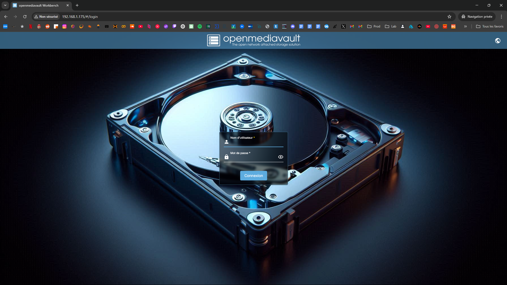
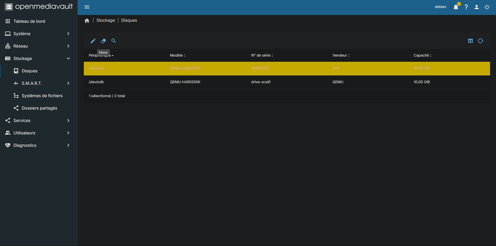
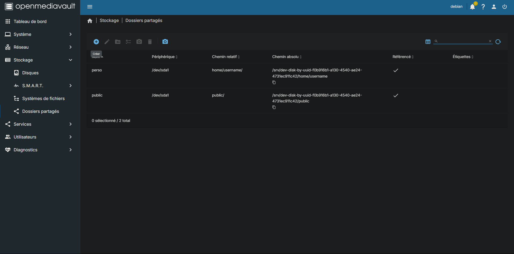
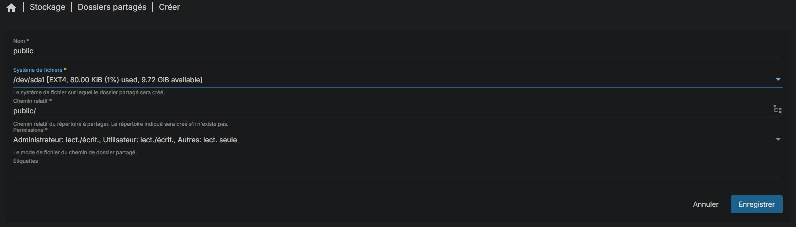
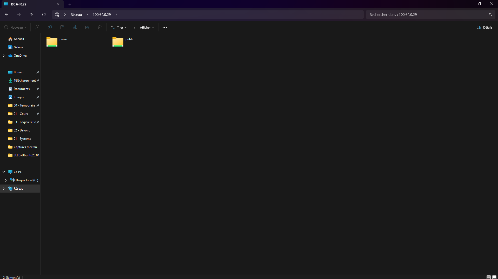
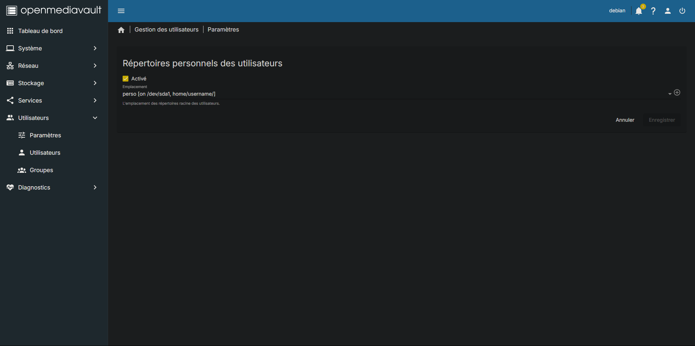
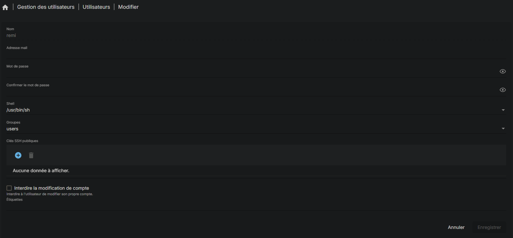

# Document 4 : Procédure d’installation et de configuration de la solution NAS (OpenMediaVault)

## 1. Introduction
Ce document décrit pas à pas la procédure d’installation d’OpenMediaVault (OMV) sur une machine Debian disposant de deux disques.

## 2. Pré-requis
- Une machine Debian (physique ou virtuelle) déjà installée.
- Deux disques :
  - Un pour l’OS Debian.
  - Un pour le stockage des données.
- Droits administrateur (sudo) pour installer OMV.
- Connexion Internet fonctionnelle pour télécharger le script d’installation.

## 3. Installation d’OpenMediaVault
1. **Ouvrir un terminal** sur la machine Debian.
2. **Exécuter la commande** suivante pour installer OMV :
   ```bash
   wget -O - https://github.com/OpenMediaVault-Plugin-Developers/installScript/raw/master/install | sudo bash
   ```
3. Attendre la fin de l’installation. Le script installe tous les paquets nécessaires et configure OMV.
4. Une fois l’installation terminée, **OpenMediaVault sera opérationnel**.
   

## 4. Connexion à l’interface Web OMV
- Ouvrez un navigateur et accédez à l’adresse IP de la machine Debian (ex. : `http://<IP_de_la_machine>/`).
- Par défaut, les identifiants sont :
  - **Utilisateur :** `admin`
  - **Mot de passe :** `openmediavault`
- Il est recommandé de changer le mot de passe `admin` dès la première connexion.

## 5. Préparer le disque de stockage
Avant de créer un partage, il faut **effacer et formater** le disque qui sera utilisé pour le stockage.
1. Dans l’interface OMV, allez dans **Storage > Disks**.
2. Sélectionnez le disque destiné au partage.
3. Choisissez l’option **Wipe** pour réinitialiser ce disque.
   

## 6. Créer le système de fichiers
1. Dans **Storage > File Systems**, cliquez sur **Create** pour formater le disque avec le système de fichiers souhaité (par exemple, EXT4).
2. Une fois créé, sélectionnez la nouvelle entrée et cliquez sur **Mount** pour monter ce système de fichiers.
3. Appliquez les changements (un bandeau “Pending changes” apparaîtra pour confirmer).

## 7. Créer un partage
1. Dans **Storage > Shared Folders**, cliquez sur **Add** (ou sur l’icône « + ») pour créer un nouveau dossier partagé.
     
   - **Name** : Indiquez le nom du partage (ex. : `PartagePublic`).
   - **File System** : Sélectionnez le système de fichiers précédemment monté.
   - **Relative Path** : Laissez OMV proposer un chemin ou personnalisez-le (ex. : `/PartagePublic`).
   - **Permissions** : Configurez les droits selon l’usage souhaité (ex. lecture seule pour le partage public).
2. Sauvegardez et appliquez les changements.
   
   

## 8. Vérification du partage
Testez l’accès depuis un autre ordinateur :
- **Windows** : Ouvrez l’explorateur et entrez `\\IP_OMV\PartagePublic`
- **Linux** : Dans un gestionnaire de fichiers, saisissez `smb://IP_OMV/PartagePublic`
- **macOS** : Dans le Finder, utilisez `Aller > Se connecter au serveur` et entrez `smb://IP_OMV/PartagePublic`
   

## 9. Activer les répertoires personnels
Pour permettre à chaque utilisateur de disposer d’un dossier personnel :
1. Dans **Access Rights Management > Users > Settings**, cochez la case **Enable user home directories** (ou l’option « Répertoire personnel »).
2. Sélectionnez le **Shared Folder** qui servira de base pour ces répertoires.
3. Enregistrez et appliquez les modifications.
   

## 10. Créer un utilisateur de test
1. Allez dans **Access Rights Management > Users**.
2. Cliquez sur **Add** (ou sur l’icône « + ») pour créer un nouvel utilisateur.
3. Renseignez le nom d’utilisateur (ex. : `remi`) et un mot de passe.
4. Enregistrez et appliquez les changements.
   

## 11. Vérification du dossier personnel
Une fois l’utilisateur créé, OMV génère automatiquement un dossier personnel pour `remi` dans le **Shared Folder** configuré pour les homes.  
Vérifiez via l’interface OMV ou en vous connectant en tant que `remi` via SMB (ex. : `\\IP_OMV\remi`).
   

## 12. Conclusion
Vous disposez désormais d’un **serveur NAS fonctionnel** sous OpenMediaVault, avec :
- Un partage public configuré (en lecture seule ou selon les droits définis).
- Un répertoire personnel automatiquement créé pour chaque utilisateur (ici, l’utilisateur `remi` a son dossier personnel).

Cette configuration de base pourra être étendue (par exemple, en ajoutant des droits spécifiques par groupe ou d’autres fonctionnalités) et servira de fondation pour la création d’une documentation utilisateur détaillée.

