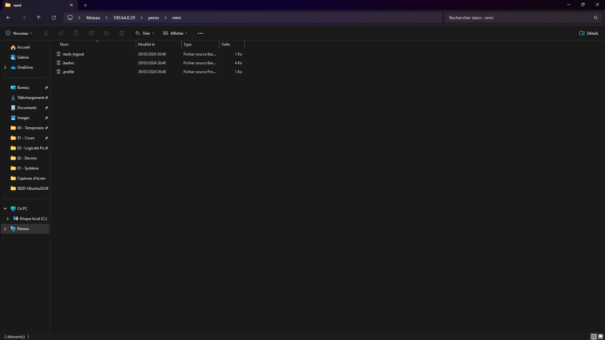

# Document 5 : Test de la Solution

Ce document présente les tests réalisés afin de vérifier que la solution NAS (OpenMediaVault) est correctement installée et configurée, et que les partages ainsi que les répertoires personnels fonctionnent comme attendu.

---

## 1. Test de l'accès au partage public

**Objectif :**  
Vérifier que le partage public (par exemple, `Public`) est accessible depuis différents systèmes d’exploitation.

**Procédure :**
- **Sur Windows :**  
  Ouvrez l'explorateur de fichiers et saisissez l'adresse suivante dans la barre d'adresse :  
  `\\100.64.0.29\Public`

- **Sur Linux :**  
  Ouvrez votre gestionnaire de fichiers et entrez l'URL :  
  `smb://100.64.0.29/Public`

- **Sur macOS :**  
  Dans le Finder, sélectionnez `Aller > Se connecter au serveur` et entrez :  
  `smb://100.64.0.29/Public`

**Résultat attendu :**  
Le dossier partagé doit s'afficher et être accessible.

---

## 2. Test de l'accès au dossier personnel

**Objectif :**  
S'assurer que chaque utilisateur dispose d'un répertoire personnel automatiquement créé et accessible.

**Procédure :**
- Créez un utilisateur de test (par exemple, `remi`).
- Connectez-vous via SMB en utilisant les identifiants de cet utilisateur et accédez à son dossier personnel en entrant :  
  `\\100.64.0.29\perso\remi`

**Résultat attendu :**  
Le dossier personnel de l'utilisateur (`remi`) doit apparaître et être accessible, permettant la lecture et l'écriture selon les droits attribués.

---

## Conclusion

Les tests effectués confirment que :
- Le partage public est correctement accessible depuis différents systèmes.
- Les dossiers personnels des utilisateurs sont créés automatiquement et fonctionnent comme prévu.

Ces résultats attestent du bon fonctionnement de la solution NAS mise en place avec OpenMediaVault.  
Pour toute anomalie ou question, veuillez contacter l'administrateur du système.
