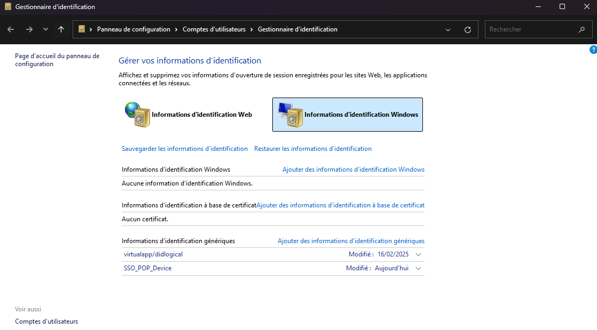
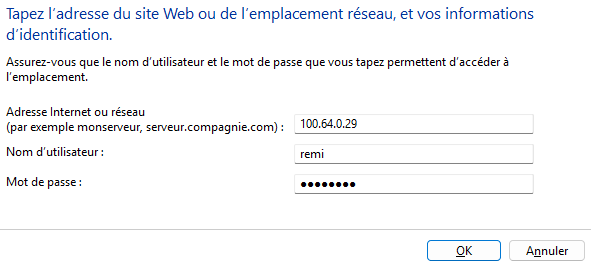
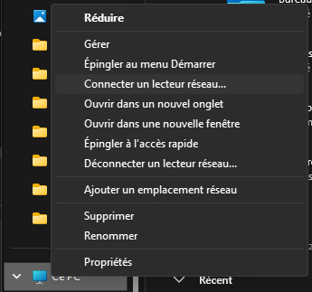
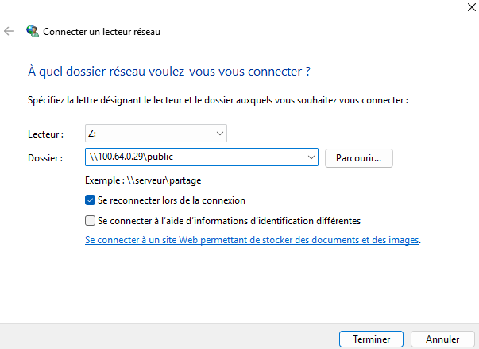
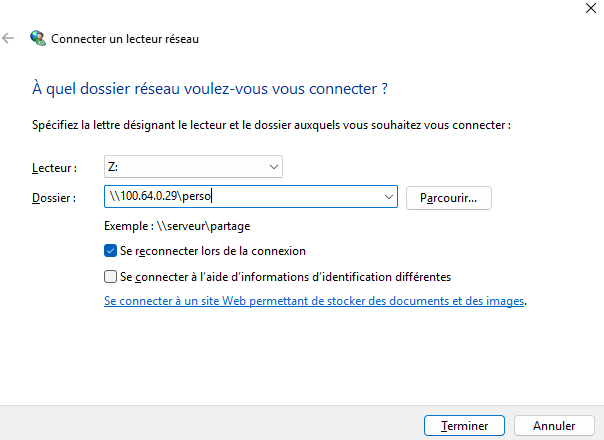

# Document 6 : Document d’accompagnement utilisateur

Ce document a pour objectif d’accompagner les utilisateurs dans la connexion à leur espace personnel sur la solution NAS. Vous trouverez ci-dessous les étapes détaillées pour ajouter vos identifiants et connecter le lecteur réseau.

---

## Étape 1 : Ajouter vos identifiants dans le gestionnaire d'identification Windows

1. **Ouvrir le gestionnaire d'identification**  
   Lancez le gestionnaire d'identification Windows depuis le menu Démarrer ou via le Panneau de configuration.

2. **Ajouter des informations d'identification**  
   Cliquez sur le bouton **"Ajouter des informations d'identification Windows"**.  
   

3. **Saisir les informations**  
   - Dans le champ dédié à l'adresse réseau, entrez l'IP **100.64.0.29**.  
   - Saisissez vos identifiants (nom d’utilisateur et mot de passe) fournis par l’administrateur.  
   

4. **Valider**  
   Cliquez sur **OK** pour enregistrer ces informations.  
   *(Vos identifiants sont maintenant sauvegardés dans le gestionnaire d'identification.)*

---

## Étape 2 : Connecter le lecteur réseau

1. **Accéder au gestionnaire de fichiers**  
   Ouvrez l’explorateur de fichiers Windows.

2. **Connexion au lecteur réseau**  
   - Faites un clic droit sur **"Ce PC"** dans le gestionnaire de fichiers.  
     
   - Sélectionnez **"Connecter un lecteur réseau"** dans le menu contextuel.

3. **Configuration du lecteur réseau Public**  
   - Dans la fenêtre qui s’ouvre, indiquez la lettre de lecteur souhaitée.  
   - Dans le champ **"Dossier"**, entrez l’adresse du partage réseau tel qu’indiqué (`\\100.64.0.29\public`).  
   - Cliquez sur **Terminer** pour valider.  
   

4. **Configuration du lecteur réseau Perso**  
   - Dans la fenêtre qui s’ouvre, indiquez la lettre de lecteur souhaitée.  
   - Dans le champ **"Dossier"**, entrez l’adresse du partage réseau tel qu’indiqué (`\\100.64.0.29\perso`).  
   - Cliquez sur **Terminer** pour valider.    
   

---

## Conclusion

Vous avez désormais ajouté vos identifiants dans le gestionnaire d'identification et connecté votre lecteur réseau. Vous pouvez accéder à votre espace personnel et aux partages mis à disposition par l’administrateur du NAS.

Si vous rencontrez des difficultés, n’hésitez pas à contacter le support ou à consulter la documentation complémentaire.
